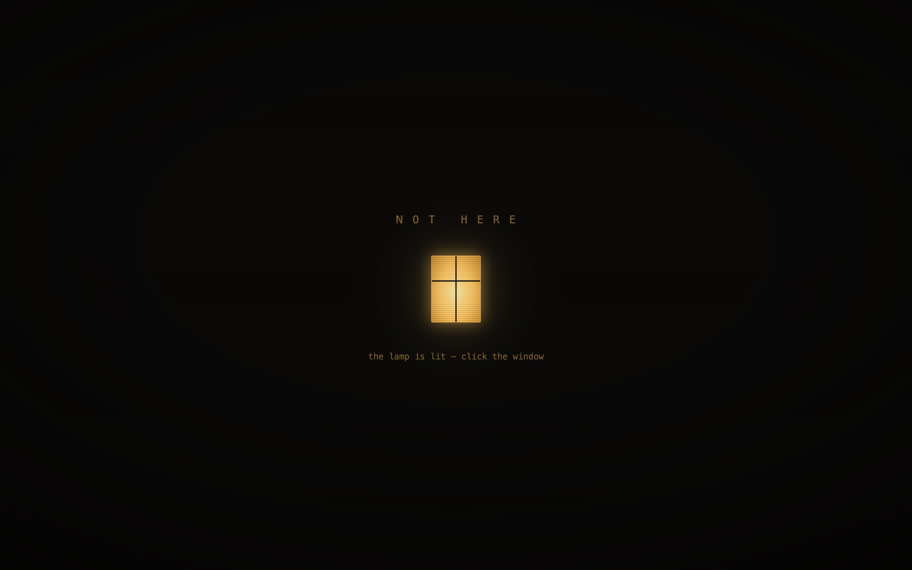
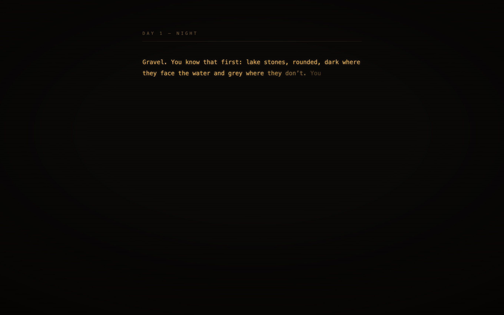
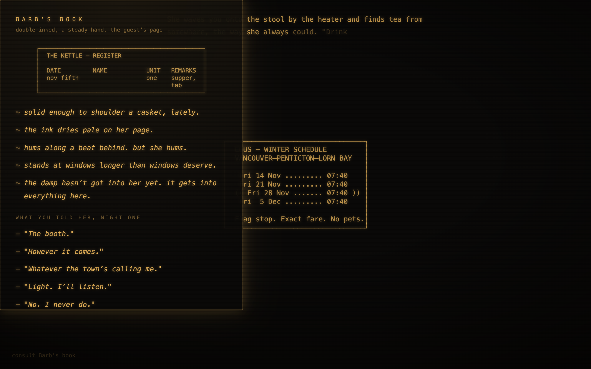
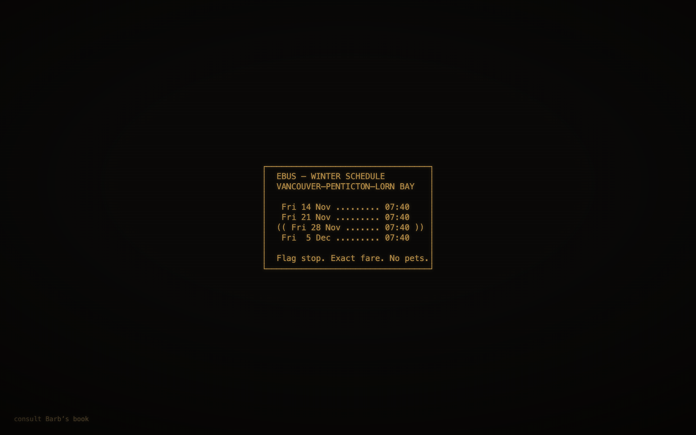

<div align="center">

# NOT HERE

*Seven years after you drowned, you walk back into the town that never stopped grieving you.*



**A branching narrative mystery.** Lorn Bay, Okanagan Valley, British Columbia — present day, early November.
Playable in the browser and in the terminal, from one shared engine.

</div>

---

## The premise

You wake on the gravel beach below the old ferry wharf, soaked through — except there is no lake smell on you, no milfoil in your cuffs, and your hair is dry at the roots. The town takes you in like a miracle: a meal, a room, a name. Nobody asks who you are. Nobody ever touches you first.

Every night at 3:12 AM, the horn on the old wharf plays five bars of a song you know in your bones — and stops where a sixth bar should begin. You could hum every note of the five. The sixth is a smooth blank, like the face of a worn coin.

You have twenty-three days. There is a date on the corkboard, ringed twice in blue pen, pressed through to the cork.

<div align="center">

</div>

## The score is the mystery

The entire soundtrack derives from one broken six-bar melody — **"The Foghorn Song"** — whose sixth bar is a rest. Each of the six townspeople owns a fragment of it: a music-box lullaby, the horn's falling third, a turn figure remembered deliberately wrong, a run whistled too fast, chords with no melody at all, a rhythm with no pitch. The game is, musically, the act of reassembling the song — and the music is mechanical: characters' instruments sour a quarter-tone when they lie, scenes you missed leave their motifs faint and detuned under the evening, and one scene has no music at all, on purpose.

Music is text here: every cue is note-data (`packages/music/scores/`) rendered by one synth engine — in the browser, in the terminal, and offline to WAV for auditioning. Every audio tell has a first-class visual twin, so the game is fully playable in silence.

## The town remembers

There is no reputation bar. There is a fact ledger: what happened, who saw it, who has been told since. Gossip moves along real edges overnight — say something to Tam on the morning run and Barb may know it by supper, and she will tell you who told her. Characters quote your own words back to you days later. Some things you can take from people are not returned.

Where you *aren't* matters as much as where you are. Each morning offers more scenes than you can attend; the ones you miss still happen, and come back that evening as secondhand retellings — warm, biased, and occasionally wrong in ways worth noticing.

## Barb's book

Your character sheet is a book a woman keeps by the till, and consulting it is asking to see what she's written about you. Her observations move as you change — no numbers, anywhere, ever. The NAME column of your register line stays blank. She's waiting to see what she'll get to write.

<div align="center">

</div>

## Documents render as documents

Letters, schedules, chord sheets, and register pages appear as artifacts, not descriptions. Some of them are clues. All of them are on screen longer than you think.

<div align="center">

</div>

## The cast

Six people, drawn in the margins of the book. One page is an empty frame.

<div align="center">
      
</div>

## Playing

```sh
pnpm install

# Browser — the full experience: adaptive score, the lit window, Barb's book
pnpm --filter @not-here/app-web dev
# then open http://localhost:5173 and click the window

# Terminal — the same town heard through a thinner wall
node apps/cli/src/main.ts
#   a number chooses · l consults the ledger · q quits
```

Both builds run the same engine and read the same story. **Act 1 is playable now** — Night 1 through the Foghorn Choice, seven days, two hard branches out. Acts 2 and 3 (the memorial potluck, the letter, six confessions, and seven endings) are in active development.

## Under the hood

```
packages/engine   pure deterministic core — advance(state, input) → {state', view, events}
packages/memory   witnessed-facts ledger, derived relationship axes, salience dialogue, gossip
packages/music    score-as-data: note-event JSON → one chiptune-folk synth, three render targets
packages/story    the authored scenes, dialogue rules, and Barb's book model
packages/ai       (in progress) limited LLM touchpoints — classification only, never authorship,
                  with complete deterministic fallbacks: the no-key game is the whole game
apps/web          Vite, vanilla TS — phosphor-on-dark ledger, typewriter prose, margin sketches
apps/cli          zero-dependency ANSI terminal build
```

Every ending, clue, and consequence is authored and deterministic. The story graph is tested mechanically: reachability of every ending, scripted golden-path walkthroughs, and a lint that enforces the game's own rules of prose — including some this README is careful not to explain.

```sh
pnpm typecheck && pnpm exec vitest run   # 350 tests
node packages/music/scripts/render-audition.ts   # render the score to auditions/*.wav
```

Design documents live in [`design/`](design/) — start with the [game bible](design/game-bible.md). *(Spoilers, obviously.)*

---

<div align="center">

**Content note:** grief, memory loss, death of a sibling, ambiguous self-dissolution.

*The horn will play again tomorrow at 3:12. Five bars, then the stop.*
*Somebody, somewhere, knows the sixth.*

</div>
