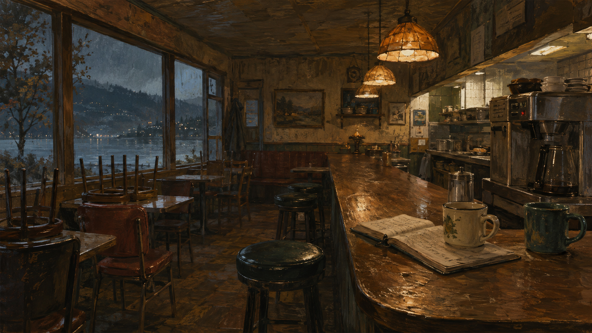

# NOT HERE

*A town has kept a place for someone. You arrive before she does.*

An intimate illustrated mystery about being loved as someone you are not. Lorn Bay, Okanagan Lake, November 6–28. A deterministic TypeScript story shared by browser and terminal.



## The revised edition

The revised story is playable from the beach through all seven endings. It includes an earlier letter discovery, a present-day exchange with Wren through Sam, a chosen name, optional preparations for arrival, and explicit ending decisions. An honest route can reach hope without any confession. Memory theft retains its cost.

All nine locations have painted compositions. The quilt loss, potluck, letters and bus arrival receive distinct staging; Wren’s ink portrait is withheld until arrival. A changed Kettle reflects work arranged under your own name. The reader includes inspectable evidence, a notebook, town map, recent pages and separate sound controls. Prose appears immediately by default. Acoustic arrangements now span the later story and endings, with exact confession identities and designed environmental sounds. Silent play includes every clue.

**Production status:** the creator approved the sample on September 7, and its art and music have been expanded. Open `/art-review.html` for the paintings and listening room; major scenes and endings sit behind spoiler disclosures. The music and environmental Foley are synthesized, not recorded performances. Voice recording, further character pose design, human listening, blind story playtests and actual screen-reader testing remain acceptance work. See [delivery and review](design/immersion-delivery.md).

## Play

```sh
pnpm install
pnpm render:audio
pnpm --filter @not-here/app-web dev
# Open http://localhost:5173

node apps/cli/src/main.ts
# Number chooses; o# observes; n notebook; h recent pages;
# m opportunities; l Barb's book; q quits. NH_SILENT=1 disables audio.
```

The opening review route follows the beach, the Kettle, Barb’s questions and the General’s upstairs room on Day 3. Try both sides of the quilt decision. Inspecting a cup or a timetable does not consume a visit. Choosing an activity does.

## Preserved original edition and saves

Open `?edition=original` in the browser, or run `NH_EDITION=original node apps/cli/src/main.ts`. The original story and UI are preserved.

The original browser key `not-here:slot1` and original CLI `.saves/slot1.json` are untouched by revised runs. The revised browser uses `not-here:story2:*`; the CLI uses `.saves/story2/`. The revised title offers export of an existing original browser save. Original paths cannot be migrated into the revised story; begin a clearly separate run. Reading and volume preferences persist independently.

## Develop and verify

```sh
pnpm typecheck
pnpm exec vitest run
pnpm story:metrics
pnpm build                 # reproduces audio, then builds the browser
```

Audio is generated locally from authored score data, without an API key. When `ffmpeg` is installed, rendering also writes compact AAC copies of revised cues; WAV fallback remains available and synchronized ensemble stems remain lossless. Development still works without rendered audio and supplies captions for missing cues. Builds include audio on demand; the browser does not preload the entire soundtrack.

| Package | Responsibility |
| --- | --- |
| packages/engine | Pure scene interpreter, facts, observations, names and presentation types |
| packages/story | Original content plus explicit edition-2 revisions and ending routes |
| packages/memory | Witness, salience, gossip and relationships |
| packages/music | Score data, synthesis, captions and reproducible WAV rendering |
| apps/web | Illustrated reader, documents, independent sound buses, original UI compatibility |
| apps/cli | Shared story, prose artifacts and terminal save/rewind |

Design spoilers: [canon](design/game-bible.md), [clue table](design/twist-recontext-table.md), [asset provenance and final prompts](design/asset-provenance.md). Earlier design decisions are retained as original-edition history.

Content: grief, memory loss, family estrangement and voluntary self-dissolution.
